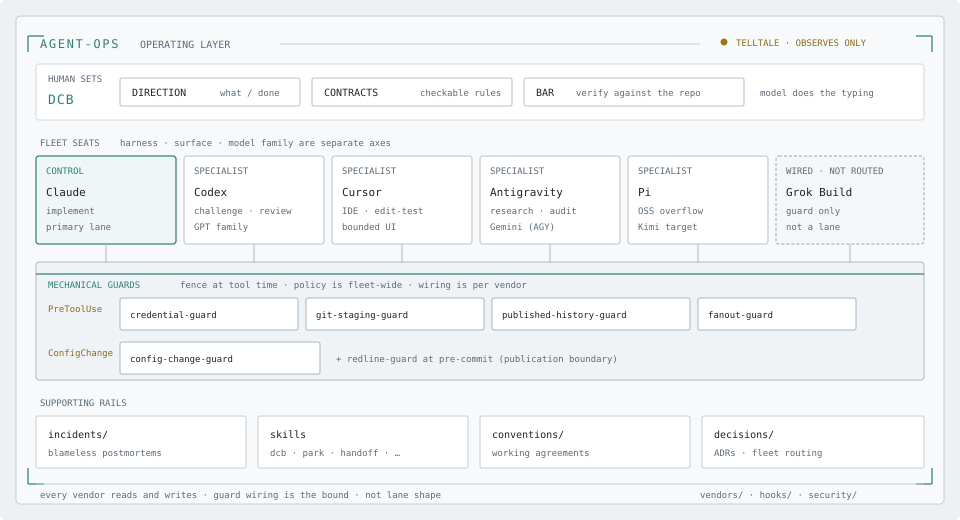

# agent-ops

Field notes from one machine. An agentic CLI sits next to real credentials.
The failure modes do not stay put, so this is public.

<picture>
  <source media="(prefers-color-scheme: dark)" srcset="images/operating-layer-hero-dark.svg">
  
</picture>

An agentic CLI runs a shell, reads config, and calls MCP servers that
hold live tokens. It also fans out work that spends money. Broad tool
access plus standing credentials is a live security surface.

This repo is the operating layer from daily use of Claude Code on one
machine. It holds a security posture and the `PreToolUse` guards that
enforce part of it. It also holds five incident postmortems, five
reusable skills, and the working agreements those pieces assume.

Four leak events landed in one week through different tool shapes. The
record is in [`incidents/`](incidents/).

## Map

- [`operating-model.md`](operating-model.md): DCB, session pre-flight,
  and the parallel-session protocol.
- [`security/`](security/): layered posture and the published credential
  hook.
  - [`posture.md`](security/posture.md): allowlists, escape hatches, and
    human-run credential work.
  - [`credential-guard.py`](security/credential-guard.py): `PreToolUse`
    block on bulk env dumps and known-sensitive reads.
  - [`README.md`](security/README.md): wiring, coverage, and the override
    convention.
- [`hooks/`](hooks/): redline guards. Detail:
  [`hooks/README.md`](hooks/README.md).
- [`incidents/`](incidents/): five postmortems. Bar: real exposure, real
  spend, or a live control that failed.
  - [`2026-07-02-plaintext-api-key-exposure.md`](incidents/2026-07-02-plaintext-api-key-exposure.md)
  - [`2026-07-02-uncapped-premium-fanout.md`](incidents/2026-07-02-uncapped-premium-fanout.md)
  - [`2026-07-03-github-pat-plaintext-recurrence.md`](incidents/2026-07-03-github-pat-plaintext-recurrence.md)
  - [`2026-07-03-credential-guard-interpreter-bypass.md`](incidents/2026-07-03-credential-guard-interpreter-bypass.md)
  - [`2026-07-04-github-pat-read-grep-leak.md`](incidents/2026-07-04-github-pat-read-grep-leak.md)
- [`debug-notes/`](debug-notes/): write-ups that did not clear the
  incident bar.
  - [`2026-07-04-graphify-console-flash-three-surfaces.md`](debug-notes/2026-07-04-graphify-console-flash-three-surfaces.md)
  - [`2026-07-25-memory-sync-orphaned-index-lock.md`](debug-notes/2026-07-25-memory-sync-orphaned-index-lock.md)
  - [`2026-08-02-sweep-relitigated-a-settled-ruling.md`](debug-notes/2026-08-02-sweep-relitigated-a-settled-ruling.md)
  - [`2026-08-03-rename-dangled-live-hook-symlinks.md`](debug-notes/2026-08-03-rename-dangled-live-hook-symlinks.md)
  - [`2026-08-04-agy-flags-that-do-not-restrict.md`](debug-notes/2026-08-04-agy-flags-that-do-not-restrict.md)
- [`conventions/`](conventions/): rules that outlived their essays.
  - [`parallel-sessions.md`](conventions/parallel-sessions.md): one
    concern, one branch, one PR
  - [`branch-hygiene.md`](conventions/branch-hygiene.md): merge deletes
    the remote ref. Sweep the local branch.
  - [`links-verify.md`](conventions/links-verify.md): verify a link
    before you send it
  - [`allowlists-fail-both-ways.md`](conventions/allowlists-fail-both-ways.md):
    a stale exception is a fail
  - [`truncation-defers.md`](conventions/truncation-defers.md): dual
    limits. Always keep a path to the rest.
  - [`truncated-producers-taint.md`](conventions/truncated-producers-taint.md):
    output from a limited run is suspect
  - [`agent-facing-contracts.md`](conventions/agent-facing-contracts.md):
    agree or disagree before the diff
  - [`agent-trigger-authorization.md`](conventions/agent-trigger-authorization.md):
    four independent checks. An unrun check is not a pass.
  - [`jsonl-splits-on-lf-only.md`](conventions/jsonl-splits-on-lf-only.md):
    never frame JSONL with Node `readline`
  - [`settled-rulings-suppress-findings.md`](conventions/settled-rulings-suppress-findings.md):
    a decided question is not a finding
  - [`feedback-hooks-are-not-guards.md`](conventions/feedback-hooks-are-not-guards.md):
    redline gates and fail-open feedback stay apart
  - [`agent-in-ci.md`](conventions/agent-in-ci.md): scoped credentials,
    proposal-only output, then a verifier
  - [`loop-safety.md`](conventions/loop-safety.md): a loop re-earns merge
    rights. [`ADR-016`](decisions/ADR-016-loops-do-not-inherit-merge-authorization.md)
  - [`hooks-gate-their-own-repair.md`](conventions/hooks-gate-their-own-repair.md):
    this clone hosts live hooks
  - [`agent-success-signals.md`](conventions/agent-success-signals.md):
    ask what a green signal measures
- [`reference/`](reference/): worked designs for problems this fleet
  does not have yet. Not rules.
- [`vendors/`](vendors/): per-vendor adapters. Root stays vendor-neutral.
  Contract: [`vendors/README.md`](vendors/README.md).
  - [`claude/`](vendors/claude/): control plane. Skills: `dcb`,
    `descope-sweep`, `park`, `proglog`, `handoff`.
  - [`codex/`](vendors/codex/): second-opinion wiring and the escalation
    packet.
  - [`cursor/`](vendors/cursor/): IDE lane.
    [`ADR-009`](decisions/ADR-009-cursor-ide-lane-in-fleet.md).
  - [`gemini/`](vendors/gemini/): Antigravity (AGY). Measured research
    and overflow lane.
  - [`pi/`](vendors/pi/): overflow harness. Target model family: Kimi.
    Parked until Kimi (interim xAI declined 2026-08-16).
    [`ADR-014`](decisions/ADR-014-pi-harness-kimi-model-target.md).
  - [`grok/`](vendors/grok/): Grok Build. Guard wiring only. Not a
    routing lane.
    [`ADR-012`](decisions/ADR-012-capability-parity-and-the-guard-obligation.md).
  - [`packet/`](vendors/packet/): cross-vendor transfer packet. Schema,
    compiler, refusals. Not a vendor.
- [`decisions/`](decisions/): the repo contract, versioned.
  - [`ADR-001-public-claude-ops-repo.md`](decisions/ADR-001-public-claude-ops-repo.md):
    scope contract
  - [`ADR-002-public-first-canonicality.md`](decisions/ADR-002-public-first-canonicality.md):
    this repo is the system of record
  - [`ADR-003-delegation-maturity.md`](decisions/ADR-003-delegation-maturity.md):
    path to full delegation
  - [`ADR-004-ref-explicit-git-in-shared-clones.md`](decisions/ADR-004-ref-explicit-git-in-shared-clones.md):
    automation targets the ref, or it refuses
  - [`ADR-005-herdr-persistence-not-agent-awareness.md`](decisions/ADR-005-herdr-persistence-not-agent-awareness.md):
    Herdr for persistence, not awareness
  - [`ADR-006-claim-the-concern-before-working-it.md`](decisions/ADR-006-claim-the-concern-before-working-it.md):
    claim the concern before the work
  - [`ADR-007-guard-the-invariant-not-the-verb.md`](decisions/ADR-007-guard-the-invariant-not-the-verb.md):
    refuse a rewrite that drops a remote `main` commit
  - [`ADR-008-agent-ops-rename-and-vendor-layer.md`](decisions/ADR-008-agent-ops-rename-and-vendor-layer.md):
    rename and the `vendors/` contract
  - [`ADR-009-cursor-ide-lane-in-fleet.md`](decisions/ADR-009-cursor-ide-lane-in-fleet.md):
    Cursor as the IDE lane
  - [`ADR-010-claude-led-four-vendor-orchestration.md`](decisions/ADR-010-claude-led-four-vendor-orchestration.md):
    one control plane, specialist lanes
  - [`ADR-012-capability-parity-and-the-guard-obligation.md`](decisions/ADR-012-capability-parity-and-the-guard-obligation.md):
    every vendor reads and writes. Guard wiring is the bound.
  - [`ADR-013-guard-canonicality-line.md`](decisions/ADR-013-guard-canonicality-line.md):
    which hooks are canonical here
  - [`ADR-014-pi-harness-kimi-model-target.md`](decisions/ADR-014-pi-harness-kimi-model-target.md):
    Pi harness. Kimi is the model target.
  - [`ADR-015-blast-reversibility-scoring-and-redaction.md`](decisions/ADR-015-blast-reversibility-scoring-and-redaction.md):
    blast × reversibility scoring and redact-and-allow
  - [`ADR-016-loops-do-not-inherit-merge-authorization.md`](decisions/ADR-016-loops-do-not-inherit-merge-authorization.md):
    a loop re-earns merge rights
- [`scripts/redline-guard.py`](scripts/redline-guard.py): pre-commit scan
  for credential shapes, private repo names, private memory links, and
  local paths. Banned terms ship as SHA-256 hashes.

## Start here

1. [`security/posture.md`](security/posture.md): the layered model this
   repo assumes.
2. [`incidents/2026-07-04-github-pat-read-grep-leak.md`](incidents/2026-07-04-github-pat-read-grep-leak.md):
   a hook on the shell still leaked through `Read` and `Grep`.
3. [`security/credential-guard.py`](security/credential-guard.py): the
   fix in the form that runs.

## Scale

This is one engineer's machine, not a team or a platform. There is no
shared incident channel and no on-call rotation. Each postmortem is a
solo session that caught its own mistake in the same turn. "Fleet" in
this repo means the agent seats on that one machine: Claude, Codex,
Cursor, Antigravity, Pi, and Grok. It does not mean people.

It is public because the failure modes do not need a team. They need an
agent with shell access, and a person who trusts it a little too soon.
